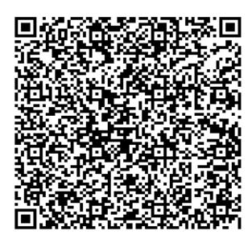

Télephone : Télecopie : Site Web :

> Nom Compte : Mode de connexion : Rang du compte : Profil : Code Client : Matricule Fiscal : Date Limite de paiement : **ONPS SMTP NP Banques 41100013 0513287HPM000 030415**

التاريــــــخ Date

Facture N° رقم فاتورة Periode : du Au المدة

Lac, 1053-Tunis,, Tunisie

71 86 17 12

71 86 11 41

www.tradenet.com.tn

رقم الهاتف رقم الفاكس موقع الواب

**50 02/01/2015 02/28/2015**

**03/04/2015**

**Office National des Postes (ONP)**

**ONPS**

**1049 TUNIS**

**Centre Informatique Complexe Hached Tunis**

المرجع الوحيد **88812500089016077795819135** Unique Référence

Copie de la facture électronique enregistrée chez TTN sous la référence : **88812500089016077795819135**

SA au capital de 2 000 000 DT/ Code TVA 736202XAM000 / RC B112602000

| Code    | Désignation       | Quantité | T.V.A. % | P.U.H.T.V.A. | Total H.T.V.A. |
|---------|-------------------|----------|----------|--------------|----------------|
| SMTP. P | C. SMTP principal | 1.0      | 12       | 50.000       | 50.000         |
| TCEAP   | Dossier TCEAP     | 2.0      | 12       | 4.500        | 9.000          |
| FDE     | Dossier FDE       | 17.0     | 12       | 4.500        | 76.500         |

البريد

Poste Coupon de Versement CCP

جذر بطاقة إيداع بحساب جاري

Bulletin de Versement CCP بطاقة إيداع بحساب جاري

Poste البريد

رقم الإصدار

رقم الإصدار

A Régler exclusivement au niveau des bureaux postaux sur présentation de la facture.

Arrête la présente facture, sauf erreur ou omission de notre part, à la somme de :

| Taux (%) | Base    | Montant TVA | Total H.T.V..  |
|----------|---------|-------------|----------------|
| 12.0     | 135.500 | 16.260      | Montant TVA    |
|          |         |             | Droit de Timbr |
| Total    | 135.500 | 16.260      | Montant T.T.   |

| Montant TVA | Total H.T.V.A.  | 135.500 |
|-------------|-----------------|---------|
| 16.260      | Montant TVA     | 16.260  |
|             | Droit de Timbre | 0.500   |
| 16.260      | Montant T.T.C   | 152.260 |

## **CENT CINQUANTE DEUX DINARS ET DEUX CENT SOIXANTE MILLIMES**